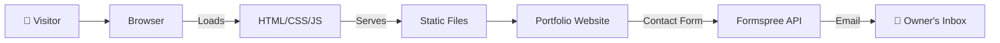

<div align="center">

# 🚀 Dulan Dhanush | Software Developer Portfolio

**A modern, fully responsive portfolio website showcasing my skills, services, and projects as a Junior Software Engineer.**

[](https://developer.mozilla.org/en-US/docs/Web/HTML)
[](https://developer.mozilla.org/en-US/docs/Web/CSS)
[](https://developer.mozilla.org/en-US/docs/Web/JavaScript)
[](https://boxicons.com/)
[](https://fonts.google.com/)
[](https://developer.mozilla.org/en-US/docs/Learn/CSS/CSS_layout/Responsive_Design)
[](https://vercel.com/)
[]()

> _“Crafting digital experiences with clean code and modern design.”_

</div>

---

## 📖 Executive Summary

This portfolio website is a **single‑page, fully responsive** showcase of my work as an aspiring Junior Software Engineer. It features a dynamic typing animation, a custom cursor, a modular services section, a gallery of my real projects (including MarketScope, Weather App, Smart Agriculture System, BaveragePotential, and the MERN Tech Blog), and a functional contact form powered by Formspree.

The design follows a **modern blue theme** with glass‑morphism cards, smooth hover effects, and a layout that adapts seamlessly to desktops, tablets, and mobile devices. All content is directly sourced from my GitHub profile and real experience – no placeholder data.

> 🔗 **Live Demo**: [dulandhanush.dev](https://your-portfolio-url.com) _(replace with actual URL when deployed)_

---

## 🏗️ Architecture Overview

The portfolio is a static website that uses plain HTML, CSS, and vanilla JavaScript – no build tools or frameworks. It relies on:

- **HTML5** for semantic structure.
- **CSS3** (custom, with CSS variables, flexbox, grid, and media queries) for styling and responsiveness.
- **Vanilla JavaScript** for interactive features: typing animation, custom cursor, mobile menu toggle, scroll‑triggered fade‑ins, and form submission with fetch.
- **Boxicons** for crisp, scalable icons.
- **Google Fonts** (Space Grotesk for headings, Inter for body, JetBrains Mono for the typing effect) for a cohesive, developer‑friendly typography.



No backend is required – the contact form is handled by Formspree’s service.

---

## ✨ Key Features

### 🏠 Hero Section

- Animated gradient greeting badge.

- Role typing animation (“I'm a Software Developer”, “Full‑Stack Engineer”, etc.).

- Call‑to‑action buttons (Hire Me / View Projects).

- Social media links (GitHub, LinkedIn, Instagram, Facebook, X) with hover effects.

### 🙋 About Me

- Modern, image‑less redesign: personal bio, journey cards, and a technical skills grid.

- Skills displayed as interactive tags (Java, C#, PHP, SQL, React, Node.js, Docker, AWS, and more).

- “Philosophy” quote highlighting core engineering principles.

### 🛠️ Services

- Five service cards (UI/UX, Full Stack, AI & Data Pipelines, Cloud & Database Arch, DevOps & CI/CD).

- Glass‑morphism cards with star badge and smooth hover lift.

- Responsive 3‑column grid (desktop) → 2 columns (tablet) → 1 column (mobile).

### 📁 Projects

- Showcase of real projects with screenshots, descriptions, and live demo / source code links.

- Projects include: MarketScope, Weather App, Smart Agriculture System, AP‑Tec Enterprise, Dulan Tech Blog, BaveragePotential.

- Buttons are centered and consistent across cards.

### 📬 Contact

- Integrated with Formspree (no backend needed).

- Input validation and real‑time feedback (sending / success / error messages).

- Fully responsive form layout.

### 🖱️ Interactive Enhancements

- Custom cursor (dot + outline) – smooth, no scroll lag, disables on touch devices.

- Scroll‑triggered animations (fade + slide‑up) for cards and sections.

- Mobile‑friendly hamburger menu with smooth transition.

---

## 🛠️ Technology Stack

```markdown
| Category          | Technologies                                                              |
| ----------------- | ------------------------------------------------------------------------- |
| **Frontend**      | HTML5, CSS3, JavaScript (ES6+), Boxicons, Google Fonts                    |
| **Styling**       | Custom CSS with variables, flexbox, grid, glass‑morphism effects          |
| **Animation**     | CSS keyframes (morphing profile image, fade‑in), JavaScript typing effect |
| **Form Handling** | Formspree (third‑party API)                                               |
| **Hosting**       | Static hosting ready – Netlify, Vercel, GitHub Pages, or any web server   |
```

---

## 📂 Directory Structure

```markdown
portfolio/
├── index.html # Main HTML document
├── style.css # All custom styles (variables, components, responsiveness)
├── script.js # JavaScript: typing, cursor, mobile menu, form, scroll animations
├── image-2.png # Profile picture
├── Screenshot 2025-11-15 125218.png # MarketScope preview
├── image.png # Weather app preview
├── icon.png # Smart Agriculture preview
├── aptec-banner.png # AP-Tec banner
├── blog banner.png # MERN blog banner
├── baverage.jpg # BaveragePotential preview
├── favicon.ico.ico # Favicon
└── README.md # This file
```

All images are referenced with relative paths – ensure they stay in the same directory as index.html.

---

## 🚀 Quick Start (Local Development)

1. Clone the repository

```bash
git clone https://github.com/DulanDhanush/portfolio.git
cd portfolio
```

2. Open the website

```bash
# Using Python 3
python -m http.server 8000
# Then open http://localhost:8000
```

3. Customisation

   **Update** index.html to change content (text, project links, social URLs).

   **Edit** style.css for colour scheme, spacing, or font changes.

   **Modify** script.js for typing roles, animation timings, or cursor behaviour.

4. Contact form

   The form uses Formspree. Replace the action URL in the <form> tag with your own Formspree endpoint if you want to receive emails.

---

## 📦 Deployment

The portfolio is completely static – you can host it anywhere:

- **GitHub Pages**
  Push to a repository, enable Pages, and point to the main branch.

- **Netlify / Vercel**
  Drag & drop the folder or connect your Git repository.

- **Any traditional web server**
  Upload all files to the public directory.

  No build step required.

---

## 👥 Credits

- **Dulan Dhanush** – Design, development, content, and deployment.

- **Boxicons** – Icon library.

- **Google Fonts** – Typography.

- **Formspree** – Free form handling service.

- **Open‑source community** – For endless inspiration and tools.

---

## 📄 License

This project is open source and available under the MIT License.
